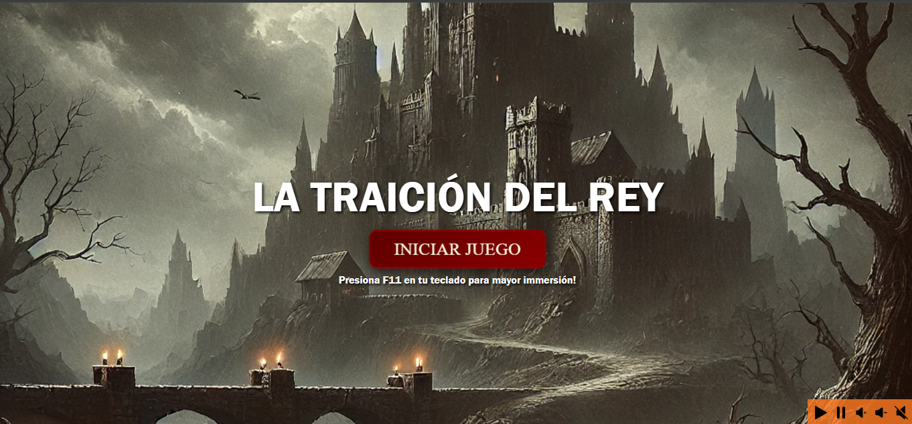
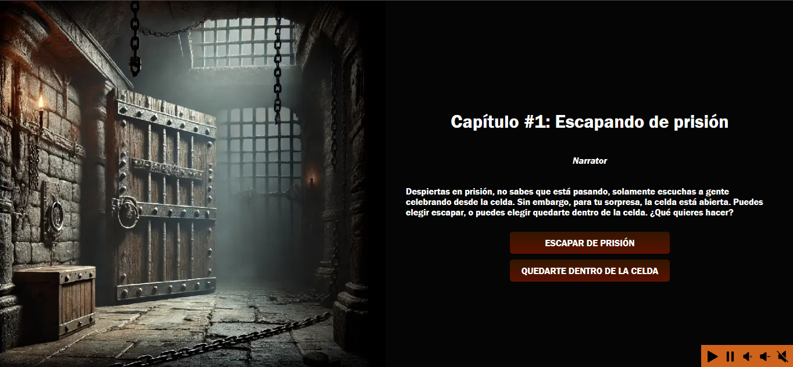
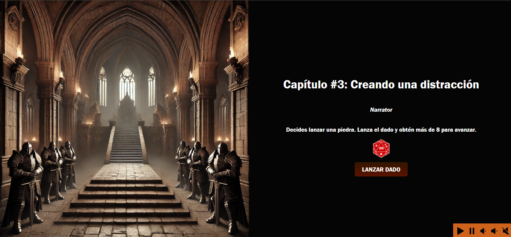
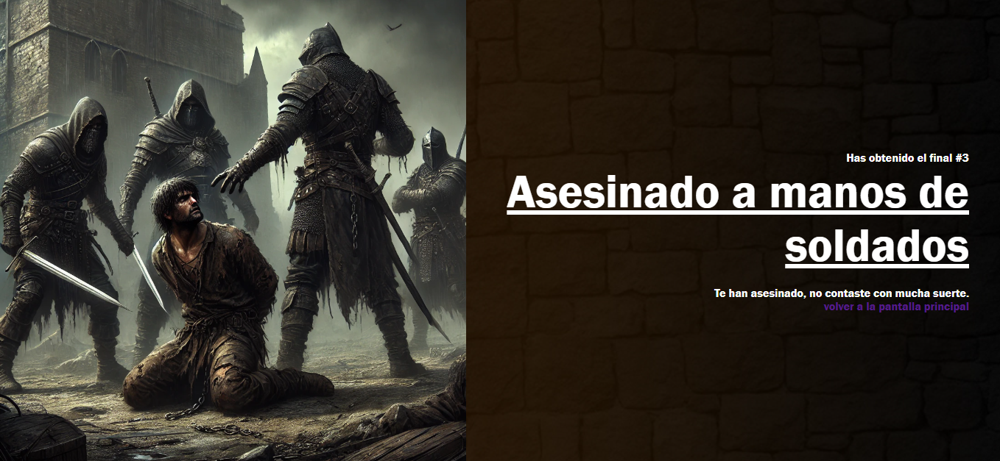
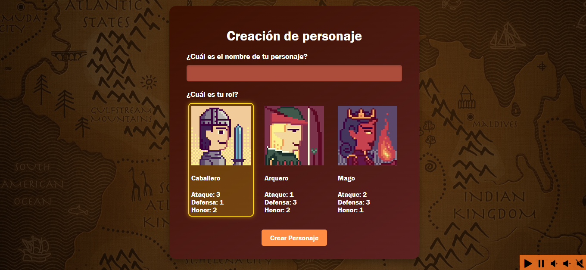
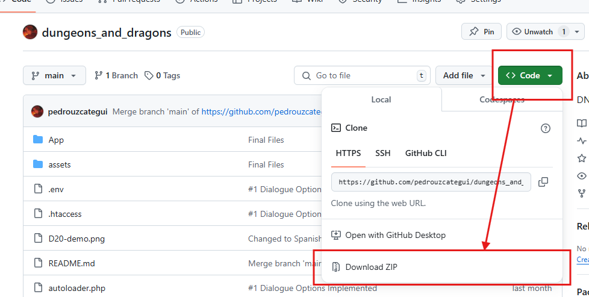
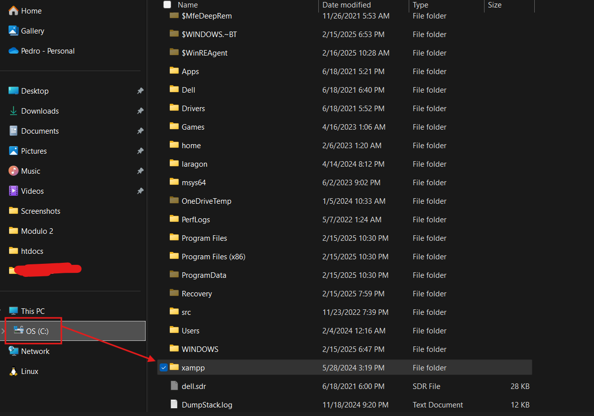
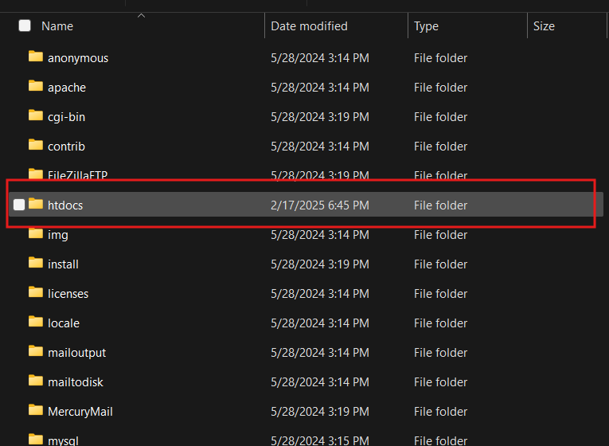
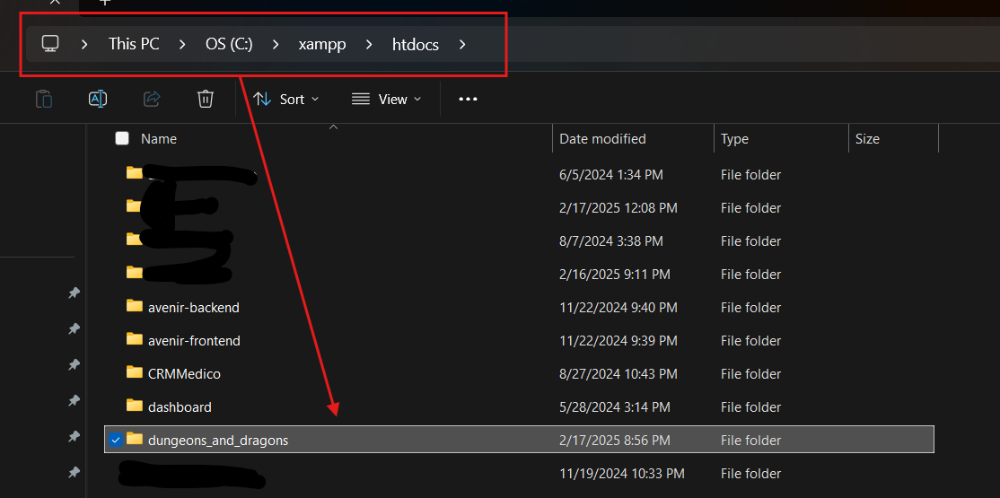

# La traición del rey (Juego RPG basado en calabozos y dragones)

Este proyecto implementa un sistema de juego para un RPG basado en Dungeons and Dragons (D&D), desarrollado en PHP y JavaScript. Está diseñado para gestionar diálogos interactivos, decisiones del jugador, y mecánicas de tiradas de dados, con una arquitectura orientada a objetos.

## Características

- **Gestión de Diálogos y Decisiones**:
  Los jugadores pueden interactuar con NPCs a través de un sistema de diálogo que permite múltiples opciones y ramificaciones según las decisiones tomadas.

  

- **Sistema de Tiradas de Dados**:
  Implementa mecánicas de tiradas de dados para determinar el éxito o el fracaso de las acciones, lo que añade aleatoriedad al juego.

  

- **6 finales diferentes**
  ¡Intenta obtener todas las vías para todos los finales!

- **3 clases para elegir**
  Elige entre arqueros, caballeros, y magos. Pero ten cuidado, pues sus atributos también afectan tus decisiones!

- **Música de ambientación**
  Disfruta de una selección de música usando el control de volumen del lado derecho!

  _NOTA: Google Chrome bloquea inicialmente la música ¡Así que será requerido que manualmente la inicies en caso de que desees escucharla!_

## Requisitos

- PHP 7.4 o superior
- Servidor Apache o compatible (recomendado usar XAMPP versión 3.3.0)
- MySQL
- Navegador moderno compatible con JavaScript y CSS

## Instalación

Hay dos maneras de realizar la instalación, manual y por git.

### Manual

1. Descarga el ZIP desde acá https://github.com/pedrouzcategui/dungeons_and_dragons
   

2. Luego, ve a tu disco duro, en mi caso es la unidad C:
   

3. Ubica la carpeta `xampp`, haz click en esa carpeta, y verás una carpeta llamada `htdocs`. Haz click en esa carpeta
   

4. Allí, descomprime el ZIP. Asegúrate que el nombre de la carpeta no sea alterado. Es decir, el nombre de la carpeta debe ser `dungeons_and_dragons`. Asegurate que el path sea `<TU_DISCO_DURO>/xampp/htdocs/dungeons_and_dragons`. Es decir, el código fuente debe estar dentro de `dungeons_and_dragons`. Es decir, la carpeta que contiene el codigo, debe quedar a este nivel:

5. Una vez allí. Activa tu Xampp/Wampp, activa los módulos de Apache y the Mysql.

6. Dirígete a `localhost/phpmyadmin`, haz click en importar, y selecciona el archivo de `init.sql`

7. Visita `localhost/dungeons_and_dragons/seed`. Este paso solo se debe hacer UNA vez, ya que es el seeder inicial de los diálogos del juego y otras cosas. Si llegases a ejecutar el seeder dos veces, deberás volver a importar el `init.sql` y ejecutar el seeder nuevamente (en el video de instalación se puede apreciar cómo resolver este problema si llegáse a ocurrir)

8. Luego, dirígete a `localhost/dungeons_and_dragons` y empieza a jugar!

### Por Git

Clona el proyecto haciendo uso de `git clone`

6. Dirígete a `localhost/phpmyadmin`, haz click en importar, copia y pega los contenidos de `init.sql`

7. Visita `localhost/dungeons_and_dragons/seed`. Este paso solo se debe hacer UNA vez, ya que es el seeder inicial de los diálogos del juego y otras cosas. Si llegases a ejecutar el seeder dos veces, deberás volver a importar el `init.sql` y ejecutar el seeder nuevamente (en el video de instalación se puede apreciar cómo resolver este problema)

8. Luego, dirígete a `localhost/dungeons_and_dragons` y empieza a jugar!

## Patrón de Desarrollo

El patrón de desarrollo elegido es MVC (Modelo-Vista-Controlador).

Este patrón consta de un archivo `index.php`, que combinado con el `.htaccess`, hace que la aplicación solamente tenga un solo punto de escucha, el cuál es el `index.php`.

Las rutas han sido registradas en `routes.php`, haciendo uso de una clase `Router` que facilita el seteo de rutas y métodos, similar a la de frameworks como `Laravel`. Cabe resaltar que la arquitectura elegida se inspiró en ciertas características de Symfony y Laravel.

## Estructura de Carpetas

- App: Esta carpeta contiene toda la lógica de la aplicación.

Dentro de la carpeta encontramos las siguientes subcarpetas y archivos:

- - Components: Son algunas partes de la interfaz que son reusables.
- - Controllers: Todos los controladores de la aplicación.
- - Models: Todos los modelos de la aplicación.
- - Views: Todas las vistas de la aplicación (con sus respectivos estilos globales)
- - Database.php: Este archivo representa la conexion a la base de datos, al igual que ciertos métodos de utilidad.
- - Request.php: Este archivo representa la entidad Request, que es un helper para realizar el procesamiento de datos de manera más sencilla.
- - Response.php: Este archivo representa la entidad Response, que es un helper para realizar el envío de datos de manera más sencilla.
- - Utils.php: Este archivo es una clase de utilidades usadas a lo largo de la app.

- assets: Contiene todos los assets de la aplicación, como imagenes, iconos, música, y tipografías.

- documentation: Contiene imagenes relacionadas a esta documentación.

- autoloader.php: Realiza el registro de namespaces y clases de manera automatica.

- config.php: Algunas variables de configuración del proyecto.

- index.php: Archivo de entrada

## Sugerencias

Si tienes alguna sugerencia o duda, puedes ponerte en contacto conmigo:

Pedro Uzcátegui
+58 4140236066
pedrouzcategui0103@gmail.com
